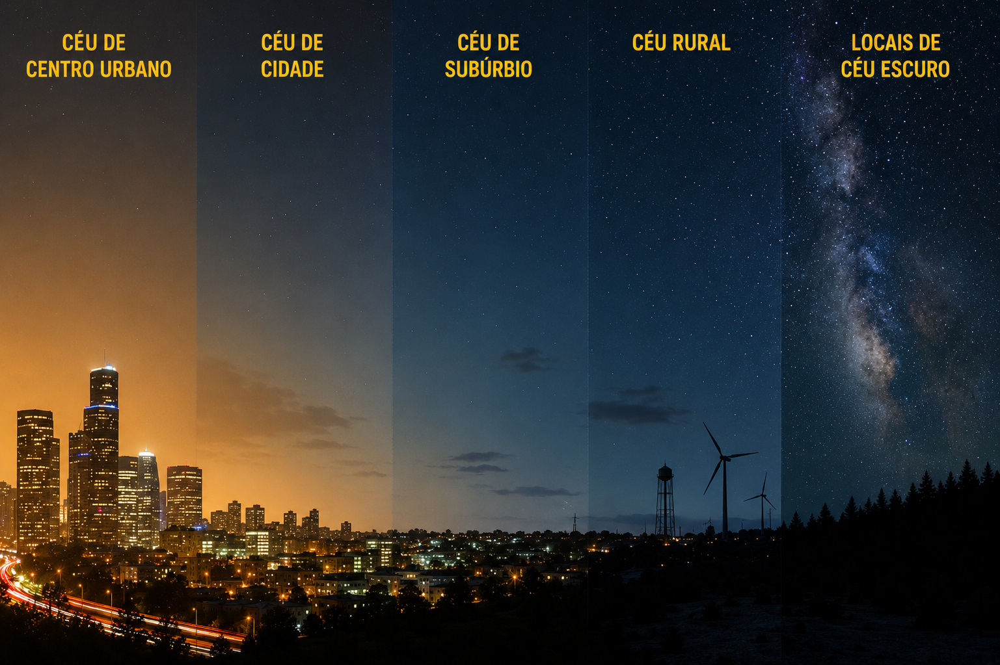
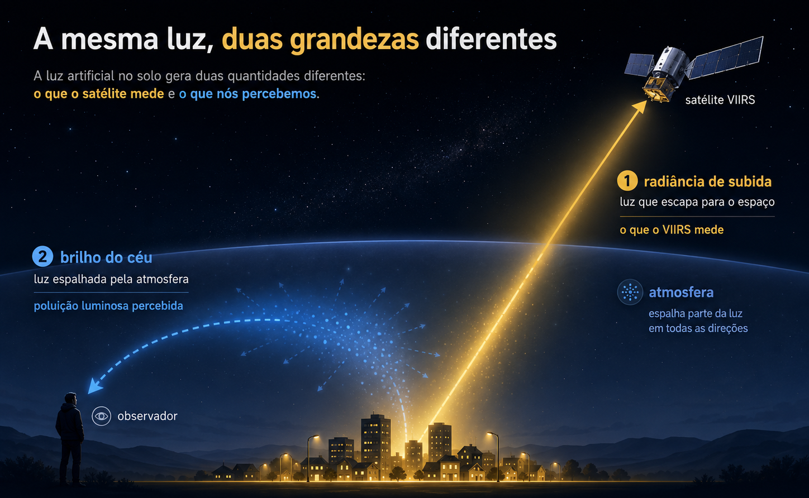
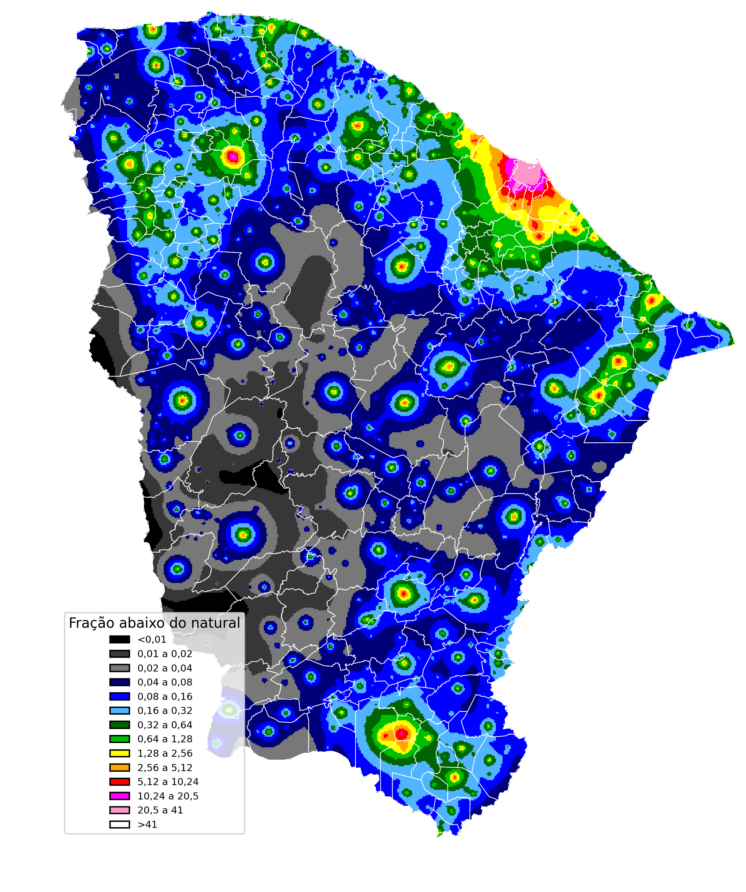

<!-- HEADER DA PÁGINA -->
<div class="hero">
  <h1>Onde Estão as Noites Escuras no Brasil?</h1>
  <h2>Por Cleber Silva e Brício Freitas</h2>
</div>

<div class="hero">
  <h2>O céu noturno natural não é apenas um recurso astronômico. Ele também faz parte da paisagem ambiental, cultural e biológica da vida humana. Um céu escuro permite que estrelas, planetas e a Via Láctea sejam vistos a olho nu. Além disso, sustenta ecossistemas noturnos, ritmos circadianos e a experiência da noite como uma condição natural distinta. Mas o avanço da tecnologia nos traz uma desconexão inconsciente com o céu. Neste artigo, vamos explorar como isso se dá.</h2>
</div>

<div class="section">
  <h1>Conceito</h1>

  A iluminação artificial desempenha diversas funções sociais e econômicas. Ela auxilia o transporte, a atividade urbana, a segurança, a indústria e a vida pública após o pôr do sol. Do espaço, o lado noturno da Terra se apresenta como redes luminosas que refletem essas características humanas. Essas imagens são impactantes porque revelam a geografia da atividade humana. Contudo, quando a luz artificial é excessiva, mal direcionada ou desnecessária, ela se espalha pelo ambiente e altera a própria noite. Esse fenômeno é comumente chamado de poluição luminosa. A figura abaixo mostra o efeito da poluição luminosa em diferentes áreas de acesso humano.

  <div class="grid grid-cols-1">
    <div class="card">
      
    </div>
  </div>

  No entanto, a visão do satélite é uma visão de cima. O brilho medido por ele não é o mesmo que a poluição luminosa percebida pelas pessoas no solo. Ele captura a luz que viaja para cima ou é dispersa para cima em direção ao sensor. Não mostra diretamente o que uma pessoa vê quando está em uma cidade, área rural ou em um local protegido com céu escuro. A poluição luminosa depende não apenas da quantidade de luz emitida para cima, mas também de como essa luz se propaga pela atmosfera, como se dispersa, qual espectro possui e como afeta a visão humana e os sistemas ecológicos. Os dados de satélite são, portanto, um ponto de partida essencial, mas não contam toda a história. A poluição luminosa é medida em microcandelas por metro quadrado (µcd/m²) de brilho artificial somado ao céu. O limiar de <strong>1,7 µcd/m²</strong> marca o ponto em que o céu deixa de ser considerado pristino; acima de <strong>87 µcd/m²</strong>, a Via Láctea já não é mais visível a olho nu para a maioria das pessoas. A figura abaixo ilustra isso.

  <div class="grid grid-cols-1">
    <div class="card">
      
    </div>
  </div>
</div>

<!-- MAPAS DO BRASIL -->
```js
import {RasterTileMap} from "./components/RasterTileMap.js";

const brazilStates = FileAttachment("./data/brazil-states.json").json({typed: true});

const viirsPng = await FileAttachment("assets/viirs_brazil_2024.png").href;
const falchiPng = await FileAttachment("assets/falchi_brazil_2015.png").href;


let viirsTilesMeta = null;
let falchiTilesMeta = null;
try {
  viirsTilesMeta = await FileAttachment("assets/tiles/viirs/metadata.json").href;
} catch (e) {
  // tiles VIIRS ainda não gerados
}
try {
  falchiTilesMeta = await FileAttachment("assets/tiles/falchi/metadata.json").href;
} catch (e) {
  // tiles Falchi ainda não gerados
}
```


<div class="section">
  <h1>Dados</h1>

  Para passar do conceito à medição, este projeto começa explorando dados do Annual VIIRS Nighttime Lights / VNL, do Earth Observation Group (EOG). Esses dados geográficos correspondem ao ano de 2024 e foram acessados usando o Google Earth Engine, focando apenas no território brasileiro. Depois de fazermos um préprocessamento, obtivemos o resultado abaixo:

  ${RasterTileMap({
      metadataUrl: viirsTilesMeta,
      fallbackImage: viirsPng,
      boundaries: brazilStates,
      width: 820,
      height: 760,
      attribution: "VIIRS/VNL 2024 · Earth Observation Group"
    })}
  
  [Falchi et al. (2016)](https://www.science.org/doi/10.1126/sciadv.1600377) produziram um atlas global de poluição luminosa (o <em>New World Atlas of Artificial Night Sky Brightness</em>) usando de modelos atmosféricos complexos. O trabalho deles estima o brilho artificial do céu no zênite usando dados de satélite, modelagem de propagação atmosférica e calibração com medições de brilho do céu feitas em solo. O [Light pollution Map](https://lightpollutionmap.app/) é um site que usa esses dados para mostrar todo o mapa mundial de poluição luminosa. Uma reprodução desse tipo de mapa para o território brasileiro encontra-se abaixo:

  ${RasterTileMap({
      metadataUrl: falchiTilesMeta,
      fallbackImage: falchiPng,
      boundaries: brazilStates,
      width: 820,
      height: 760,
      attribution: "Falchi et al. (2016), World Atlas 2015"
    })}

  O atlas é útil porque conecta observações de satélite a uma quantidade relevante para o solo: a luminância artificial do céu. Em vez de perguntar apenas “Onde a Terra é brilhante à noite?”, o atlas faz uma pergunta mais ambiental, título da próxima seção.
</div>


<div class="section">
  <h1>Quanto brilho artificial é adicionado ao céu noturno acima de diferentes lugares na Terra?</h1>

  O <em>New World Atlas of Artificial Night Sky Brightness</em> estima, para cada país, qual fração da população e do território está exposta a cada faixa de brilho artificial do céu. Começamos pela exposição da população, analisando quantas pessoas vivem sob algum grau de céu poluído. O gráfico abaixo mostra o percentual da população exposta a qualquer brilho artificial (>1,7 µcd/m²). Nele, cada ponto é um país (ou agregado). No eixo vertical, a população exposta a qualquer brilho artificial, que é praticamente saturada perto de 100%. No horizontal, a porcentagem território ainda escuro. Detacamos países (ou agregados) de interesse para essas analises com as suas respectivas bandeiras. Também mostramos onde o próprio mundo (representado por uma logo de globo terrestre) se encontra nesse diagrama. Os dados foram retirados da tabela 2 de Falchi et al. (2016).

  <!-- SCATTER PLOT DOS PAÍSES -->
  ```js
  import {scatterPaises} from "./components/scatter_paises.js";

  const falchi_raw = await FileAttachment("./data/falchi_2016_table2_light_pollution_selected_flags.csv").csv({typed: true});
  const earthIconURL = FileAttachment("./images/mundo.png").href;
  const falchi = falchi_raw.map((d) => ({...d, flag_URL: d.country_or_region === "World" ? earthIconURL : d.flag_URL}));
  ```
  <div class="grid grid-cols-1">
    <div class="card">
      ${resize((width) => scatterPaises(falchi, {width}))}
    </div>
  </div>

  Os países com população exposta à luz artificial abaixo de 80% são, em geral, aqueles onde a escuridão ainda coincide espacialmente com áreas habitadas, especialmente em contextos de baixa densidade urbana, grande população rural, menor intensidade de iluminação noturna e presença de extensas regiões naturais, desérticas, florestais, montanhosas ou insulares. Muitos deles estão na África subsaariana, além de alguns países asiáticos e arquipélagos, onde grandes centros urbanos luminosos são menos numerosos ou menos extensos. Isso não significa necessariamente melhor controle da poluição luminosa; muitas vezes reflete menor infraestrutura luminosa, menor urbanização ou ocupação mais dispersa. O contraste com o Brasil é importante: o país ainda possui grandes áreas escuras, mas elas abrigam uma parcela pequena da população, enquanto a maior parte dos brasileiros vive em regiões urbanas já expostas a níveis relevantes de brilho artificial do céu.Para os países (ou agregados) de interesse, geramos um gráfico de distribuição por faixa de brilho (µcd/m²), convertida de valores cumulativos para faixas não sobrepostas:

  <!-- ANÁLISE FOCADA NOS PAÍSES DE INTERESSE -->
  ```js
  import {barrasPaisesSelecionados} from "./components/barras_paises.js";
  ```
  <div class="grid grid-cols-1">
    <div class="card">
      ${resize((width) => barrasPaisesSelecionados(falchi, {width}))}
    </div>
  </div>

  O gráfico de barras mostra que, nas regiões selecionadas, uma parcela muito pequena da população vive sob condições verdadeiramente escuras. No caso do Brasil, a faixa de menor brilho artificial, abaixo de 1.7 µcd/m², praticamente não aparece, o que não significa ausência de áreas escuras no país, mas sim que essas áreas são pouco povoadas. Como o gráfico é ponderado pela população, países como Argentina, Canadá e Estados Unidos aparecem fortemente concentrados nas faixas mais intensas de brilho artificial, refletindo a concentração de habitantes em grandes centros urbanos ou corredores metropolitanos.

  China e Índia apresentam outro padrão: embora tenham enormes populações expostas à luz artificial, essa exposição se distribui mais pelas faixas intermediárias, com menor concentração relativa na classe extrema acima de 3000 µcd/m². O caso brasileiro reforça uma distinção central para a análise: a pergunta “onde ainda existem noites escuras?” não é equivalente a “quem vive sob noites escuras?”. O Brasil ainda conserva grandes extensões territoriais com céu pouco brilhante artificialmente, mas a maior parte da população vive em regiões urbanas e periurbanas onde o brilho artificial do céu já é elevado.
</div>


```js
import {scatterEstados} from "./components/scatter_estados.js";
import {rankingRadianciaTotal} from "./components/ranking_radiancia_total.js";
import {rankingRadianciaMedia} from "./components/ranking_radiancia_media.js";
import {radianciaPorRegiao} from "./components/radiancia_por_regiao.js";

const estados = await FileAttachment("./data/viirs_brazil_states_2024.csv").csv({
  typed: true
});
``` 

<!-- BALANÇO DOS ESTADOS BRASILEIROS -->

<div class="section">
  <h1>Análise dos Estados Brasileiros</h1>

  A radiância média e a radiância total contam histórias complementares sobre a iluminação noturna no território brasileiro. A radiância total indica quanto cada estado contribui para o brilho noturno observado por satélite no conjunto do país, enquanto a radiância média indica a intensidade média dessa emissão dentro do território estadual. Por isso, estados grandes e populosos podem ter radiância total elevada mesmo com média moderada, enquanto estados pequenos e altamente urbanizados podem ter média muito alta sem dominar o total nacional. Isso pode ser visto no gráfico abaixo.

  <div class="grid grid-cols-1">
    <div class="card">
      <h2>Radiância média e radiância total nos estados brasileiros</h2>
      ${resize((width) => scatterEstados(estados, {width}))}
    </div>
  </div>

  No gráfico de dispersão, São Paulo se destaca por combinar radiância média elevada com a maior radiância total do país, refletindo a escala de sua rede urbana e econômica. O Distrito Federal aparece como um caso distinto: sua radiância média é a mais alta entre os estados, mas sua radiância total é menor, devido à pequena extensão territorial. Minas Gerais, Bahia e Rio Grande do Sul aparecem com radiância total elevada, mas média mais moderada, indicando que a emissão luminosa se acumula sobre grandes áreas. O Ceará ocupa uma posição relevante no cenário nacional: não está entre os maiores valores médios, mas aparece entre os principais contribuintes em radiância total, o que justifica uma análise mais detalhada antes de passarmos à escala estadual. Além disso, o ranking de radiância total evidencia quais estados mais contribuem para a emissão luminosa noturna observada no Brasil. Como pode ser observado no gráfico abaixo da, São Paulo ocupa uma posição dominante, respondendo sozinho por aproximadamente um quinto da radiância total dos estados brasileiros. Em seguida aparecem Minas Gerais, Paraná, Bahia, Rio de Janeiro, Rio Grande do Sul e Santa Catarina, revelando o peso das regiões com redes urbanas extensas, alta concentração populacional e forte atividade econômica. Esse gráfico é importante porque a radiância total não mede apenas a intensidade local da iluminação, mas também o acúmulo espacial das fontes luminosas. Estados territorialmente grandes ou com muitas cidades médias podem aparecer com valores altos mesmo quando sua radiância média não é extrema. O Ceará aparece entre os dez maiores valores de radiância total do país, em posição próxima a Pernambuco, reforçando que o Nordeste não é apenas uma região periférica nessa análise: ele tem contribuição expressiva para o brilho noturno nacional.


  <div class="grid grid-cols-2">
    <div class="card">
      <h2>Estados com maior radiância total</h2>
      ${resize((width) => rankingRadianciaTotal(estados, {width, n: 12}))}
    </div>
    <div class="card">
      <h2>Estados com maior radiância média</h2>
      ${resize((width) => rankingRadianciaMedia(estados, {width, n: 12}))}
    </div>
  </div>

  O ranking de radiância média destaca outro aspecto do problema: a intensidade média da luz emitida dentro de cada território estadual. Aqui, estados compactos e fortemente urbanizados ganham destaque. O Distrito Federal aparece em primeiro lugar, muito acima dos demais, porque concentra uma mancha urbana intensa em um território relativamente pequeno. Rio de Janeiro e São Paulo também aparecem entre os maiores valores, refletindo a forte urbanização e a concentração de infraestrutura luminosa. Esse gráfico deve ser lido com cuidado, porque uma radiância média alta não significa necessariamente que o estado tenha a maior contribuição total para o brilho do país. Ela indica que, proporcionalmente ao seu território, a emissão luminosa é mais intensa. Sergipe, Alagoas, Espírito Santo, Santa Catarina, Pernambuco e Paraíba aparecem bem posicionados por esse motivo. O Ceará surge em uma posição intermediária-alta: sua média não é tão extrema quanto a do Distrito Federal ou do Rio de Janeiro, mas é suficiente para colocá-lo acima de estados muito extensos, como Minas Gerais, Bahia, Goiás, Pará e Mato Grosso.

  Ao agrupar os estados por região no gráfico abaixo, fica claro que a radiância total brasileira é fortemente concentrada no Sudeste, que responde por cerca de 40% do total nacional. Isso é consistente com a presença de grandes metrópoles, alta densidade populacional, forte infraestrutura urbana e intensa atividade econômica. O Nordeste aparece em segundo lugar, com aproximadamente 24% da radiância total, superando Sul, Centro-Oeste e Norte. Esse resultado é especialmente importante para a narrativa do projeto. Embora o Sudeste concentre a maior parte da emissão luminosa, o Nordeste possui peso expressivo no balanço nacional. Isso cria uma transição natural para o Ceará: dentro de uma região que já contribui de forma significativa para a radiância total do Brasil, o estado aparece entre os principais destaques. A partir desse ponto, a análise pode deixar a escala nacional e investigar como essa luz se distribui internamente no Ceará, separando o peso de Fortaleza e da Região Metropolitana das demais áreas do estado.

  <div class="grid grid-cols-1">
    <div class="card">
      <h2>Participação regional na radiância total</h2>
      ${resize((width) => radianciaPorRegiao(estados, {width}))}
    </div>
  </div>
</div>


<!-- DADOS DA SEÇÃO DO CEARÁ -->
```js
import {cearaRankingRadianciaTotal} from "./components/ceara_ranking_radiancia_total.js";
import {cearaMapaResiduoLuminoso} from "./components/ceara_mapa_residuo_luminoso.js";
import {cearaBarrasResiduoLuminoso} from "./components/ceara_barras_residuo_luminoso.js";
import {cearaResiduoVsAreaIluminada} from "./components/ceara_residuo_vs_area_iluminada.js";
import {cearaRankingCeuEscuro} from "./components/ceara_ranking_ceu_escuro.js";
import {cearaGraficoResiduoLuminoso} from "./components/ceara_grafico_residuo_luminoso.js";

const ceara_residuo = await FileAttachment("./data/ceara_residuo_luminoso_municipios.csv").csv({
  typed: true
});
const ceara = await FileAttachment("./data/ceara_residuo_luminoso_municipios.csv").csv({typed: true});
const cearaGeo = await FileAttachment("./data/ceara_municipios.geojson").json();
```

<div class="section">
  <h1>Análise do Céu Noturno no Ceará</h1>

  Antes de perguntar onde ainda existem noites escuras, precisamos entender onde a luz artificial está mais concentrada. O ranking de radiância total abaixo mostra os 10 municípios que mais contribuem para o brilho noturno observado por satélite no Ceará. Fortaleza aparece como o principal centro emissor, mas a luz noturna do estado não se limita à capital: municípios da Região Metropolitana, do litoral e polos regionais como Sobral e Juazeiro do Norte também aparecem entre os maiores valores. Esse primeiro gráfico mostra, portanto, a geografia básica da emissão luminosa cearense: uma concentração forte na metrópole, mas acompanhada por núcleos importantes no interior e em áreas estratégicas do território.

  <!-- RANKING DE RADIÂNCIA TOTAL -->
  <div class="grid grid-cols-1">
    <div class="card">
      <h2>Onde a luz noturna se concentra no Ceará?</h2>
      ${resize((width) => cearaRankingRadianciaTotal(ceara, {width, n: 10}))}
    </div>
  </div>

  No entanto, a radiância total favorece naturalmente municípios mais populosos, urbanizados ou territorialmente extensos. Por isso, o próximo passo é perguntar se esses municípios são luminosos apenas porque concentram mais pessoas, ou se alguns deles brilham mais do que seria esperado para sua densidade demográfica. Para separar o efeito da densidade populacional da emissão luminosa propriamente dita, usamos um modelo que relaciona a radiância média municipal com a densidade demográfica. A linha do gráfico abaixo representa o valor esperado: municípios próximos a ela seguem o padrão geral do Ceará, municípios acima da linha são mais luminosos do que o esperado e municípios abaixo são menos luminosos do que o esperado. A cor dos pontos traduz essa diferença, chamada aqui de resíduo luminoso.

  <!-- SCATTER DO RESÍDUO LUMINOSO -->
  <div class="grid grid-cols-1">
    <div class="card">
      ${resize((width) => cearaGraficoResiduoLuminoso(ceara_residuo, {width}))}
    </div>
  </div>

  Essa análise muda a interpretação. Fortaleza, Maracanaú, Eusébio, Aquiraz e São Gonçalo do Amarante não se destacam apenas porque estão em áreas densas ou urbanizadas, mas porque apresentam radiância acima do padrão esperado para sua densidade. Essa intensidade luminosa pode estar associada não apenas à concentração populacional, mas também à infraestrutura urbana, atividades econômicas, polos industriais, turismo, circulação viária ou centralidade regional. Fortaleza, por exemplo, figura como o grande centro urbano do estado. Maracanaú e São Gonçalo do Amarante refletem dinâmicas industriais e logísticas, enquanto Juazeiro do Norte se destaca como um polo regional crucial no Cariri. Já outros municípios aparecem menos luminosos do que o modelo preveria, sugerindo padrões urbanos mais compactos, menor intensidade de iluminação artificial ou características locais que reduzem a emissão observada por satélite. Depois de identificar esses desvios no gráfico, o passo seguinte é observar nos mapas abaixo onde eles aparecem no território.

  <!-- MAPA DO RESÍDUO LUMINOSO -->
  <div class="grid grid-cols-2">
      <div class="card">
      <h2>Municípios mais ou menos luminosos que o esperado</h2>
      ${resize((width) => cearaMapaResiduoLuminoso(cearaGeo, ceara, {width}))}
    </div>
    <div class="card">
      
    </div>
  </div>

  O mapa do resíduo luminoso espacializa a análise anterior. Em vez de mostrar apenas os municípios mais brilhantes em termos absolutos, ele mostra onde a luz é maior ou menor do que o esperado pela densidade demográfica. Isso ajuda a revelar padrões territoriais: excessos luminosos associados à Região Metropolitana de Fortaleza, ao litoral, a polos regionais e a possíveis áreas de infraestrutura, enquanto alguns municípios serranos ou interiores aparecem com valores abaixo do esperado. A comparação com o mapa de brilho artificial do céu reforça uma distinção importante do projeto: a radiância VIIRS mede a luz emitida para cima e observada por satélite, enquanto o brilho artificial do céu representa melhor a luz espalhada na atmosfera e percebida como poluição luminosa. Assim, os dois mapas não precisam coincidir perfeitamente. O primeiro mostra fontes e padrões de emissão considerando demografia, ao passo que o segundo aproxima melhor a experiência do céu noturno. Essa diferença prepara a próxima pergunta: quais municípios são os casos mais extremos desse desvio?

  <!-- BARRAS DE EXCESSO E DÉFICIT LUMINOSO -->
  <div class="grid grid-cols-1">
    <div class="card">
      <h2>Maiores excessos e déficits luminosos</h2>
      ${resize((width) => cearaBarrasResiduoLuminoso(ceara, {width, n: 5}))}
    </div>
  </div>

  O gráfico de barras acima resume os casos mais extremos do modelo. De um lado estão os municípios com maior excesso luminoso, ou seja, aqueles que emitem mais luz do que seria esperado para sua densidade demográfica. Do outro estão os maiores déficits luminosos, municípios menos luminosos do que o esperado. Essa visualização é útil porque transforma o modelo estatístico em uma leitura direta: quem está acima e quem está abaixo do padrão estadual. Os maiores excessos podem estar associados a urbanização intensa, iluminação pública, atividade econômica, turismo, eixos viários, áreas industriais ou infraestrutura específica. Já os déficits não significam ausência de ocupação humana, mas sim menor emissão luminosa relativa. Isso torna o resíduo luminoso uma métrica mais interpretativa do que a radiância bruta. Ainda assim, resta uma dúvida importante: o excesso de luz está espalhado pelo município ou concentrado em poucos pontos muito intensos?

  <!-- RESÍDUO VERSUS ÁREA ILUMINADA -->
  <div class="grid grid-cols-1">
    <div class="card">
      <h2>Brilho excedente: espalhado ou pontual?</h2>
      ${resize((width) => cearaResiduoVsAreaIluminada(ceara, {width}))}
    </div>
  </div>

  A relação mostrada no gráfico acima entre resíduo luminoso e área iluminada ajuda a diferenciar dois tipos de municípios. Alguns combinam resíduo positivo com grande porcentagem de área acima do limiar de radiância, indicando uma iluminação mais espalhada pelo território. Outros têm resíduo positivo, mas área iluminada menor, sugerindo que poucos focos intensos podem elevar a média municipal sem representar uma mancha luminosa ampla. Essa distinção é essencial para evitar interpretações simplistas. Dois municípios podem ter excesso luminoso, mas por razões diferentes: um pode ter uma malha urbana extensa e iluminada; outro pode ter uma instalação industrial, porto, rodovia, equipamento turístico ou núcleo urbano concentrado. Depois de entender onde a luz se concentra, onde ela excede o esperado e se esse excesso é espalhado ou pontual, podemos inverter a pergunta: onde ainda seria possível procurar céus mais escuros?

  <!-- CANDIDATOS A CÉU ESCURO -->
  <div class="grid grid-cols-1">
    <div class="card">
      <h2>Onde ainda procurar céus mais escuros?</h2>
      ${resize((width) => cearaRankingCeuEscuro(ceara, {width, n: 12}))}
    </div>
  </div>

  O ranking de candidatos a céu escuro muda o foco da análise. Em vez de destacar os municípios mais luminosos, ele procura aqueles com menor radiância média, menor área iluminada e menor contribuição para a luz noturna estadual. Essa visualização responde a uma pergunta mais próxima do leitor: onde, em princípio, ainda haveria melhores condições para observar um céu noturno menos afetado pela iluminação artificial? Vemos que os municípios de Aiuba, Tarrafas e Poranga se destacam nesse quesito. Essa resposta, porém, precisa ser lida como um ponto de partida, não como uma recomendação final de observação. Um bom local para observar o céu depende também de acesso, segurança, hospedagem, relevo, cobertura de nuvens, estação do ano, fase da Lua e distância real das fontes luminosas. Portanto, os dados VIIRS ajudam a indicar municípios promissores, mas a escolha de locais de observação exige cruzar essa informação com critérios práticos e ambientais. Em essência, regiões em preto, cinza, azul e verde no mapa de poluição luminosa já representam boas escolhas de observação.
</div>


<style>

.hero {
  display: flex;
  flex-direction: column;
  align-items: center;
  font-family: var(--sans-serif);
  margin: 4rem 0 8rem;
  text-wrap: balance;
  text-align: center;
}

.hero h1 {
  margin: 1rem 0;
  padding: 1rem 0;
  max-width: none;
  font-size: 14vw;
  font-weight: 900;
  line-height: 1;
  background: linear-gradient(30deg, var(--theme-foreground-focus), currentColor);
  -webkit-background-clip: text;
  -webkit-text-fill-color: transparent;
  background-clip: text;
}

.hero h2 {
  margin: 0;
  max-width: 34em;
  font-size: 20px;
  font-style: initial;
  font-weight: 500;
  line-height: 1.5;
  color: var(--theme-foreground-muted);
}

@media (min-width: 640px) {
  .hero h1 {
    font-size: 90px;
  }
}

</style>
